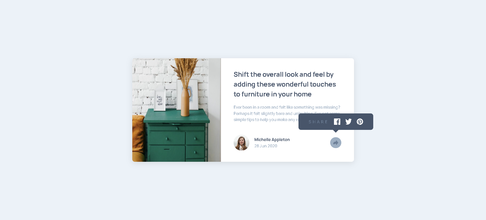
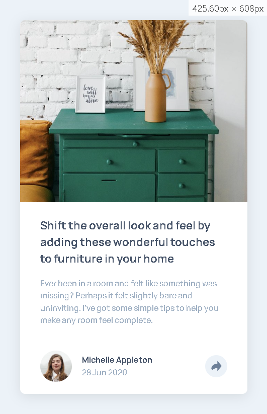
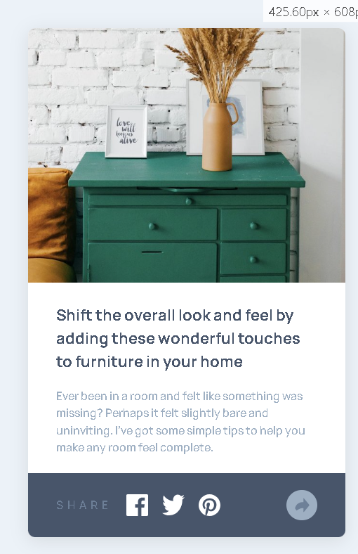

# Frontend Mentor - Article Preview Component Solution

This is my solution to the [Article preview component challenge on Frontend Mentor](https://www.frontendmentor.io/challenges/article-preview-component-dYBN_pYFT). The goal was to build a responsive article preview card with a share feature.

## Table of Contents

- [Overview](#overview)
  - [The Challenge](#the-challenge)
  - [Screenshot](#screenshot)
  - [Links](#links)
- [My Process](#my-process)
  - [Built With](#built-with)
  - [What I Learned](#what-i-learned)
  - [Continued Development](#continued-development)
  - [Useful Resources](#useful-resources)
- [Author](#author)

## Overview

### The Challenge

Users should be able to:

- View the optimal layout for the component depending on their device's screen size
- See the social media share links when they click the share icon

### Screenshot

### Links

- [Github](https://github.com/ffozdemir/article-preview-component)
- [Live Site](https://incandescent-cajeta-828f13.netlify.app)

## My Process

### Built With

- Semantic HTML5 markup
- CSS custom properties
- Flexbox
- Mobile-first workflow

### What I Learned

- Gained experience with responsive layouts using Flexbox and Grid.
- Improved my understanding of toggling UI elements (share menu) with JavaScript.
- Practiced structuring semantic HTML for accessibility.

### Continued Development

- Explore more advanced accessibility features.
- Refine the share menu animation and transitions.
- Experiment with CSS variables for easier theming.

### Useful Resources

- [MDN Web Docs - Flexbox](https://developer.mozilla.org/en-US/docs/Web/CSS/CSS_Flexible_Box_Layout/Basic_Concepts_of_Flexbox)
- [CSS-Tricks - A Complete Guide to Grid](https://css-tricks.com/snippets/css/complete-guide-grid/)

## Author

- Frontend Mentor - [@ffozdemir](https://www.frontendmentor.io/profile/ffozdemir)
- Github - [@ffozdemir](https://www.github.com/ffozdemir)
